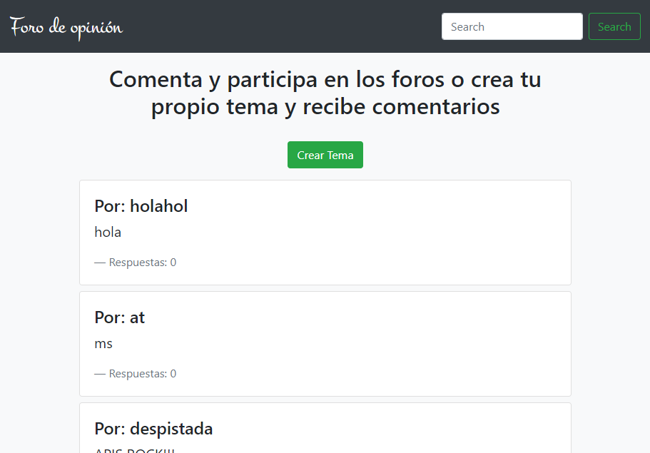
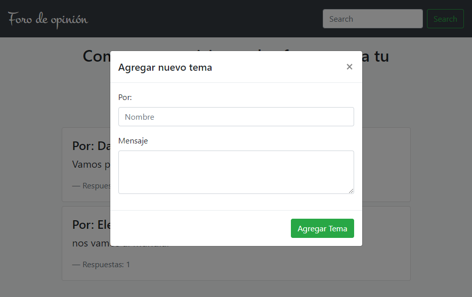
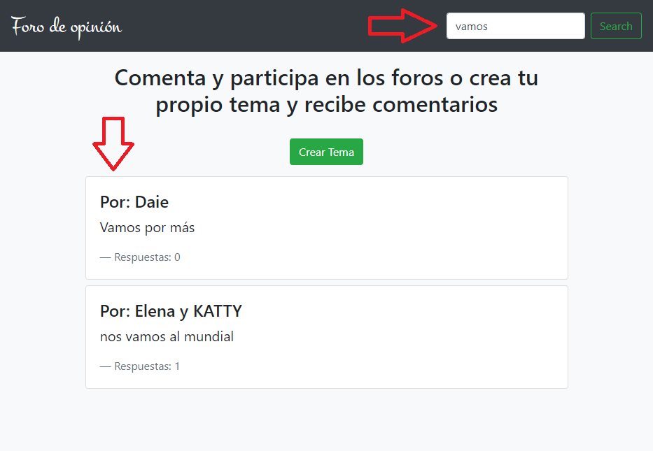

# FORO DE OPINIÓN

* **Track:** _FRONT-END-DEVELOPER_
* **Curso:** _Construye una Single Page App (spa) multi-usuario consumiendo data remota_
* **Unidad:** _5_

***

## Introducción 

Foro de Opinión es una aplicación que ofrece al usuario crear y consultar temas y las respuestas a esos temas.

## Plan de trabajo

El proyecto se desarrolló en dos días y se crearon los siguientes issues y milestones que sirven como hoja de ruta (roadmap):

*  Inicializar el proyecto con babel, servidor, jquery, bootstrap. 
* Primer maquetado.
* Funcionalidad para imprimir todos los temas.
* Funcionalidad para crear temas.
* Funcionalidad para filtrar por título.
* Elaborar readme.

## Archivos importantes

El proyecto presenta los siguientes archivos para uso del usuario:

* `README.md` con descripción de la aplicación, uso y ejemplo.
* `index.js`: Archivo js que contiene la funcionalidad de la aplicación.
* `index.html`: Página web de la aplicación.

## Especificaciones

* Se utilizó el Foro API.
* Se utilizó la librería jQuery en su versión 3.2.1 (como parte del framework bootstrap y como parte del desarrollo).
* Se utilizó el framework bootstrap en su versión 4.0.
* Se utilizó el estándar más recientemente aceptado de JavaScript ES2015 || ES6.
* Se utilizó el transpilador/compilador Babel para que convierta nuestro código en ES5 de forma automática.
* Se utilizó el servidor de node.js.
* Mobile first.

***

## Uso
* Al abrir la aplicación se despliega una lista de todos los temas del foro con los siguientes datos: elaborado por, contenido, cantidad de respuestas.
* El usuario puede crear su propio tema, dándole click al botón verde “Crear tema”.
* Además, el usuario puede filtrar temas del foro en base a su título y dando click al botón “search”.

## Ejemplo

* Vista principal del proyecto:

* Crear un tema propio:

* Buscador de temas:

***

## Autoras

* Rocci Escobar Nuñez [Cuenta GitHub](https://github.com/Rocciescobar "Repositorio")
* Manuela Flores Vilchez [Cuenta GitHub ](https://github.com/ManuelaFlores "Repositorio")
